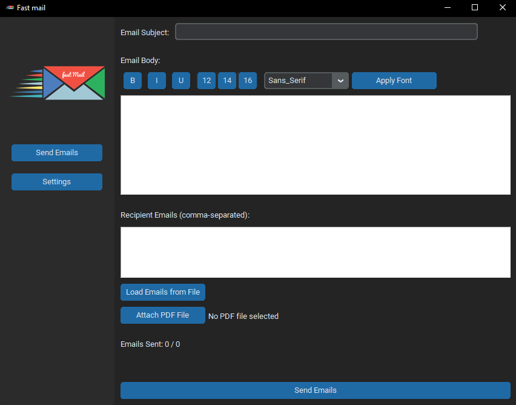
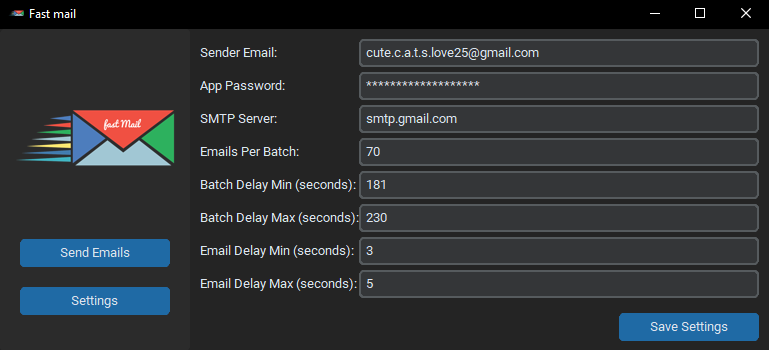

# Fast Mail

Fast Mail is a desktop application designed for sending bulk emails efficiently. The application provides a user-friendly interface for composing emails, managing recipients, and configuring SMTP settings. This document provides an overview of the application's features, installation instructions, and usage guidelines.

## Features

- **Compose Emails**: Easily write and format your email content.
- **Manage Recipients**: Load recipient emails from a file or enter them manually.
- **Batch Email Sending**: Configure batch sizes and delay intervals to manage email sending.
- **SMTP Configuration**: Set your SMTP server, sender email, and app password.
- **Attach Files**: Option to attach a PDF file to the emails.
- **Track Emails Sent**: Display the count of emails sent.

## Screenshots

### Home Screen


### Settings Screen


## Installation

1. Clone the repository:
    ```sh
    git clone https://github.com/badrelkhiri/Fast-mail.git
    ```
2. Navigate to the project directory:
    ```sh
    cd fastmail
    ```
3. Install the required dependencies:
    ```sh
    pip install -r requirements.txt
    ```

## Usage

1. Run the application:
    ```sh
    python fastMail.py
    ```
2. **Home Screen**: 
    - Enter the email subject and body.
    - Format the email body using the provided tools (Bold, Italic, Underline, Font Size, and Font Family).
    - Enter recipient emails manually or load from a file.
    - Attach a PDF file if needed.
    - Click 'Send Emails' to start sending emails.

3. **Settings Screen**: 
    - Enter the sender email and app password.
    - Set the SMTP server details.
    - Configure the emails per batch, batch delay, and email delay.
    - Save the settings.

## How to Get an App Password

To use Fast Mail, you need to generate an app password for your email account. Here's how you can do it:

1. **Google Account**:
    - Go to your [Google Account Security page](https://myaccount.google.com/security).
    - Under "Signing in to Google," select "App passwords."
    - You might need to sign in. If you don’t have 2-Step Verification turned on, you'll need to turn it on first.
    - At the bottom, choose "Select app" and choose the app you’re using.
    - Choose "Select device" and choose the device you’re using.
    - Select "Generate."
    - Follow the instructions to enter the app password (the 16-character code in the yellow bar) on your device.

2. **Other Email Providers**:
    - Check your email provider's documentation or support page for instructions on generating an app password.
    - Typically, this can be found in the security settings of your email account.

## Configuration

- **Sender Email**: Your email address.
- **App Password**: Your email application's password.
- **SMTP Server**: SMTP server address (e.g., smtp.gmail.com).
- **Emails Per Batch**: Number of emails to send per batch.
- **Batch Delay**: Delay between batches (in seconds).
- **Email Delay**: Delay between individual emails (in seconds).

## Contributing

Contributions are welcome! Please fork the repository and submit a pull request.

## License

This project is licensed under the MIT License - see the [LICENSE](LICENSE) file for details.
